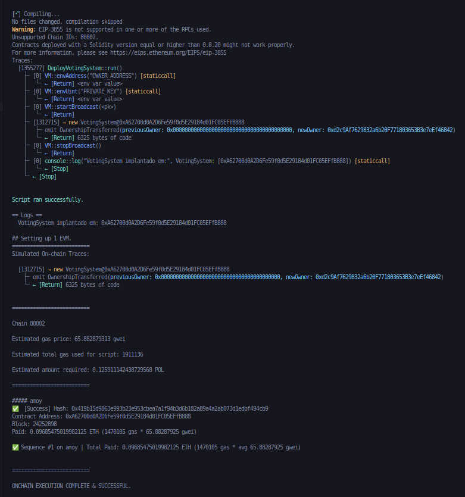
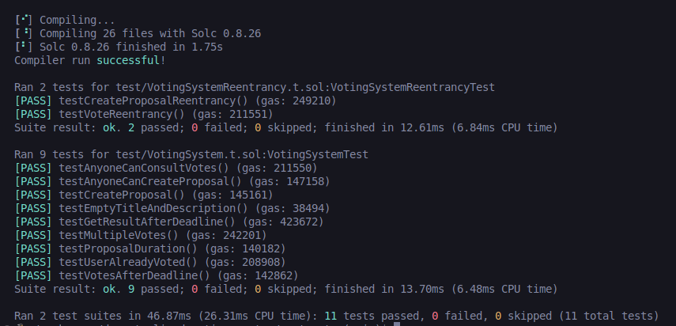
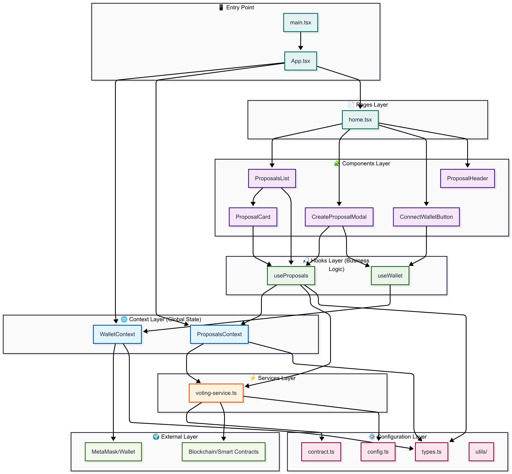

<h1 align="center">Decentralized Voting System</h1>

<p align="center">
  

  

  

  

  <!--  -->

  <!--  -->

  <!--  -->
</p>

<!-- Status -->

<!-- <h4 align="center"> 
	🚧  Decentralized Voting System 🚀 Under construction...  🚧
</h4> 

<hr> -->

## About

Sistema de votação descentralizado implementado em Solidity com frontend em React, permitindo que usuários criem propostas e votem de forma anônima e transparente na blockchain.

**[Frontend Live Deploy](https://decentralized-voting-system-theta.vercel.app/)**

## Features

- **Criação de Propostas**
  - Qualquer usuário pode criar uma proposta
  - Cada proposta contém título, descrição e ID único

- **Sistema de Votação**
  - Um voto por usuário por proposta - proteção contra dupla votação
  - Votos anônimos
  - Opções: A favor ou Contra
  - Janela de votação fixa de 1 semana (604.800 segundos)

- **Resultados Transparentes**
  - Consulta pública de votos "a favor" e "contra"
  - Resultado automático: Aprovada ou Rejeitada
  - Atualização em tempo real após cada voto
  - Bloqueio automático após prazo de votação

## Technologies

- Smart Contract: Solidity ^0.8.26
- Framework de Desenvolvimento: Foundry
- Frontend: React + Vite + TypeScript
- Styling: Tailwind CSS
- Blockchain: Polygon Amoy Testnet
- Web3: ethers.js
- Segurança: OpenZeppelin Contracts (ReentrancyGuard, Ownable, Pausable)
- Deploy: Vercel

## Smart Contract
- Rede: Polygon Amoy Testnet
  - **[CONTRACT ADDRESS | POLYGONSCAN](https://amoy.polygonscan.com/address/0xA62700d0A2D6Fe59f0d5E29184d01FC05EFfB888)**

##### Deploy do contrato no Foundry


#### Funcionalidades
- **Criar Proposta**
`function createProposal(string memory _title, string memory _description) external nonReentrant whenNotPaused `

  - Usuário pode criar uma proposta
  - Cria uma nova proposta com título e descrição
  - Gera ID único automaticamente
  - Define prazo de votação de 1 semana

- **Votar**
` function vote(uint256 _proposalId, bool support) external nonReentrant whenNotPaused`

  - Permite usuário votar
  - _proposalId: ID da proposta
  - _support: `true` para "A favor", `false` para "Contra"
  - Verifica se a proposta existe
  - Verifica se o usuário já votou
  - Verifica se a votação ainda está no prazo de 1 semana

- **Consultar Resultados**
`function getResult(uint256 _proposalId) public view returns (string memory)`
  - Retorna resultado atual: `Aprovada` ou `Rejeitada`
  - Acesso público: qualquer pessoa pode consultar
  - Resultado é calculado em tempo real: `votesFor > votesAgainst = APPROVED` se não `REJECTED`


#### **Segurança**

- Proteções Contra Ataques
  -  ReentrancyGuard: Proteção contra ataques de reentrância usando nonReentrant
  -  Ownable: Controle de acesso para funções administrativas
  -  Pausable: Capacidade de pausar operações em emergências
  -  Custom Errors: Economia de gas com erros personalizados (EmptyTitle, EmptyDescription, ProposalNotFound)

- Validações de Segurança
   - Overflow Protection: Solidity ^0.8.26 com proteção nativa + unchecked
   - Input Validation: Verificação de strings vazias e IDs válidos
   - Time-based Security: Validação rigorosa de prazos de votação

- Bibliotecas Utilizadas
  ```
  @openzeppelin-manual/ReentrancyGuard.sol";
  @openzeppelin-manual/Ownable.sol";
  @openzeppelin-manual/Pausable.sol";
  ```
- Funções Administrativas (Owner)
  ```
  function pause() external onlyOwner    // Pausa o contrato
  function unpause() external onlyOwner  // Retoma operações
  ```

#### Testes Implementados
O contrato possui cobertura completa de testes usando Foundry:

##### Testes Funcionais Principais

✅ testCreateProposal - Criação de propostas com validação completa
✅ testUserAlreadyVoted - Proteção contra dupla votação
✅ testAnyoneCanConsultVotes - Consulta pública de resultados
✅ testGetResultAfterDeadline - Resultado automático após prazo
✅ testProposalDuration - Validação de duração de 1 semana
✅ testVotesAfterDeadline - Bloqueio de votos após prazo

##### Testes de Validação

✅ testEmptyTitleAndDescription - Validação de campos obrigatórios
✅ testAnyoneCanCreateProposal - Verificação de acesso público
✅ testMultipleVotes - Cenários de empate e múltiplos votantes

##### Testes de Segurança

✅ testCreateProposalReentrancy - Proteção contra reentrância na criação
✅ testVoteReentrancy - Proteção contra reentrância na votação
✅ MaliciousAttacker Contract - Simulação de ataques reais

##### Executar Testes
```
# Todos os testes
forge test

# Testes específicos
forge test --match-test testCreateProposal

# Com detalhes e gas report  
forge test -vvv --gas-report

# Testes de segurança específicos
forge test --match-contract VotingSystemReentrancyTest

# Com cobertura de código
forge coverage
```



### Estrutura e arquivos principais do projeto

```
.
├── contracts/                          # Tudo relacionado aos contratos
│   ├── src/
│   │   └── VotingSystem.sol            # Smart contract principal
│   ├── lib/
│   │   └── openzeppelin-manual/        # Bibliotecas de segurança (manual)
│   │       ├── ReentrancyGuard.sol     # Prevenção contra reentrância
│   │       ├── Ownable.sol             # Controle de ownership
│   │       └── Pausable.sol            # Funcionalidade de pausa
│   ├── script/
│   │   └── DeployVotingSystem.s.sol    # Script de deploy Foundry
│   ├── test/
│   │   ├── VotingSystem.t.sol          # Testes funcionais principais
│   │   └── VotingSystemReentrancy.t.sol # Testes de reentrancy
│   ├── foundry.toml                    # Configuração do Foundry
│   └── .env                           # Variáveis de ambiente
│
└── frontend/                          # Aplicação web/dapp
    ├── src/
    │   ├── components/                # Componentes React
    │   ├── hooks/                     # Custom hooks
    │   ├── contexts/                  # Context providers
    │   ├── contracts/                 # ABIs e configurações do contrato
    │   ├── config/                    # Configurações da blockchain
    │   ├── utils/                     # Utilitários
    │   ├── pages/                     # Páginas
    │   └── services/                  # Serviços
    ├── public/                       # Arquivos estáticos
    └── package.json                  # Dependências do frontend
```

### Arquitetura Frontend


#### Como Executar Localmente

- **Pré-requisitos**

  - Foundry
  - Node.js >= 16
  - NPM ou Yarn
  - MetaMask ou carteira Web3 conectada na rede Polygon Amoy Testnet

#####  Smart Contract (Foundry)
```
# Instalar Foundry (se não instalado)
curl -L https://foundry.paradigm.xyz | bash
foundryup

# Clonar o repositório
git clone https://github.com/thomasdev5832/decentralized-voting-system
cd decentralized-voting-system/contracts

# Instalar dependências do Foundry
forge install

# Compilar contratos
forge build

# Executar todos os testes
forge test

# Executar testes com verbosidade detalhada
forge test -vvv

# Testes com relatório de gas
forge test --gas-report

# Deploy na testnet Polygon Amoy
forge script script/DeployVotingSystem.s.sol \
    --rpc-url $POLYGON_AMOY_RPC_URL \
    --private-key $PRIVATE_KEY \
    --broadcast \
    --verify \
    --etherscan-api-key $ETHERSCAN_API_KEY
```

#### Frontend
```
# Navegar para pasta do frontend
cd frontend

# Instalar dependências
npm install

# Executar em desenvolvimento
npm run dev

# Build para produção
npm run build
```

#### Configuração
- MetaMask - Polygon Amoy
  - Network Name: Polygon Amoy
  - RPC URL: https://rpc-amoy.polygon.technology/
  - Chain ID: 80002
  - Currency Symbol: POL
  - Block Explorer: https://amoy.polygonscan.com/

#### Variáveis de Ambiente (blockchain)
Crie um arquivo .env na raiz da pasta /contracts:

```
# Para Deploy com Foundry
POLYGON_AMOY_RPC_URL=https://rpc-amoy.polygon.technology/
PRIVATE_KEY=sua_chave_privada (com 0x no início)
ETHERSCAN_API_KEY=sua_chave_api_polygonscan
OWNER_ADDRESS=endereço_que_será_owner_do_contrato
```

#### Configuração do foundry.toml
```
[profile.default]
src = "src"
out = "out"
libs = ["lib"]
solc_version = "0.8.26"

[rpc_endpoints]
amoy = "${POLYGON_AMOY_RPC_URL}"

[etherscan]
amoy = { key = "${ETHERSCAN_API_KEY}", url = "https://api-amoy.polygonscan.com/api" }
```

#### Configuração da integração do Frontend com contrato na blockchain

```
# Acessar pasta frontend/src/contracts/contract.ts

# Atualizar o CONTRACT_ADDRESS com o endereço do novo contrato
# Atualizar o ABI com o ABI do novo contrato

# Melhorias futuras:
  - Implementar o CONTRACT_ADDRESS no .env do frontend
  - ABI em um arquivo externo
```

#### Desafios 
- Implementar voto 100% anônimo na blockchain
  - O contrato atual usa apenas pseudonimização, o que permite correlacionar votantes com seus votos através de metadados off-chain ou padrões de transação.
    - Soluções Possíveis:
      - ZK-Snarks: Garante privacidade total com provas criptográficas, melhor solução, mas bem mais complexa.
      - Commit-Reveal: Oculta votos temporariamente, mas o anonimato é parcial. Após o deadline revelam voto+segredo para validação
      - Ring Signatures: Mistura assinaturas para dificultar rastreamento mas requer um grupo mínimo de participantes

    - Próximos passos: implementar ZK-Snarks para anonimato mantendo a auditabilidade. Pseudonimização só é válida para cenários não sensíveis.

- Pouco Faucet POL na Polygon Amoy disponível
  - A escassez de POL na testnet Amoy dificultaram os testes.
  - Solução temporária: optou-se por implementar primeiro na Sepolia, que possui faucets mais acessíveis. Posteriormente foi possível obter 100 POL através do Bulk Faucet da Polygon Technology, permitindo a migração para a Amoy.

- RPCs da Polygon Amoy são instáveis e possuem rate limits

- Verificar contrato pelo Foundry na rede Polygon Amoy devido ao Foundry estar na versão nightly
  - Solução adotada: Contrato foi verificado utilizando o PolygonScan

#### Links úteis

- [Documentação Foundry](https://book.getfoundry.sh/)
- [Documentação Solidity](https://docs.soliditylang.org/)
- [Polygon Docs](https://docs.polygon.technology/)
- [React Documentation](https://reactjs.org/)
- [Vite Documentation](https://vitejs.dev/)

##### License

This project is under license from MIT. For more details, see the [LICENSE](LICENSE.md) file.


&#xa0;

<a href="#top">Back to top</a>
